# Ανάλυση Ιατρικών Εικόνων MedMNIST με CNN, Transfer Learning & Vision Transformers (PyTorch)

**Κατσάρος Ζήσης, 10666**

---

## Περιεχόμενα

- [Εισαγωγή](#εισαγωγή)
- [Περιγραφή Συνόλου Δεδομένων](#περιγραφή-συνόλου-δεδομένων)
- [Πλήρης Εκπαίδευση CNN](#πλήρης-εκπαίδευση-cnn)
  - [Εκπαίδευση χρήση διαφορετικών τιμών Υπερπαραμέτρων](#εκπαίδευση-χρήση-διαφορετικών-τιμών-υπερπαραμέτρων)
  - [Επιπλέον τεχνικές εκπαίδευσης](#επιπλέον-τεχνικές-εκπαίδευσης)
- [Εκπαίδευση CNN αξιοποιώντας Transfer Learning](#εκπαίδευση-cnn-αξιοποιώντας-transfer-learning)
  - [Feature Extraction](#feature-extraction)
  - [Fine-Tuning](#fine-tuning)
- [Εκπαίδευση ViT αξιοποιώντας Transfer Learning](#εκπαίδευση-vit-αξιοποιώντας-transfer-learning)
  - [Feature Extraction (ViT)](#feature-extraction-vit)
  - [Fine-Tuning (ViT)](#fine-tuning-vit)
- [Συμπεράσματα](#συμπεράσματα)

---

## Εισαγωγή

Η παρούσα εργασία αφορά την ταξινόμηση ιατρικών εικόνων από το σύνολο MedMNIST χρήση βαθέων νευρωνικών δικτύων. Στα πλαίσια αυτής, εκπαιδεύτηκε εξολοκλήρου ένα μικρό συνελικτικό νευρωνικό δίκτυο και χρησιμοποιήθηκαν προ-εκπαιδευμένα ένα CNN και ένας vision transformer αξιοποιώντας transfer learning.

Παρακάτω, θα παρουσιαστούν τα αποτελέσματα που προέκυψαν κατά την δοκιμή αυτών των μοντέλων, θα εξεταστούν οι καμπύλες των μετρικών loss και accuracy σε train και validation και θα υπολογιστούν τα confusion matrix. Επιπλέον, θα σχολιαστεί πως οι διάφορες επιλογές υπερπαραμέτρων επηρεάζουν την απόδοση των μοντέλων. Τέλος, για την περίπτωση του transfer learning θα γίνει σύγκριση ανάμεσα σε feature extraction και fine-tuning.

---

## Περιγραφή Συνόλου Δεδομένων

Το dataset το οποίο επιλέχθηκε είναι το OrganSMNIST. Εμπεριέχει grayscale εικόνες διαστάσεων $28 \times 28$ που αναπαριστούν ανατομικές δομές της θωρακικής, κοιλιακής και πυελικής χώρας. Το σύνολο αποτελείται από $25221$ δείγματα, τα οποία χωρίζονται ως $13932/2452/8827$ σε train, validation και test αντίστοιχα.

Ο πίνακας παρακάτω αναπαριστά τις κλάσεις του συνόλου και το ποσοστό των (training) δειγμάτων που ανήκουν σε κάθε κλάση. Γρήγορα διαπιστώνει κανείς πως υπάρχει σημαντική ανισορροπία στις κλάσεις, η οποία γίνεται ιδιαίτερα αντιληπτή στην περίπτωση του αριστερού και δεξιού μηριαίου οστού. Οι δύο προαναφερθείσες κλάσεις αποτελούν μόλις τα $4.52\%$ και $4.41\%$ του συνόλου, γεγονός το οποίο, όπως θα φανεί παρακάτω, έχει επιπτώσεις στην απόδοση των μοντέλων.

Στην εικόνα παρακάτω δίνεται παράδειγμα μίας εικόνας από κάθε κλάση.

| Όνομα Κλάσης | Ποσοστό (%) |
|---|---|
| **Bladder** | 8.24 |
| **Femur-Left** | 4.52 |
| **Femur-Right** | 4.41 |
| **Heart** | 5.18 |
| **Kidney-Left** | 8.13 |
| **Kidney-Right** | 8.03 |
| **Liver** | 24.86 |
| **Lung-Left** | 5.32 |
| **Lung-Right** | 5.76 |
| **Pancreas** | 14.38 |
| **Spleen** | 11.17 |

*Πίνακας 1: Κατανομή Κλάσεων*

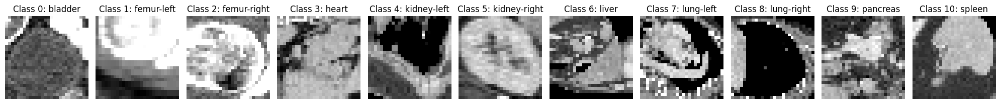

*Εικόνα 1: Παράδειγμα μίας εικόνας από κάθε κλάση*

---

## Πλήρης Εκπαίδευση CNN

Στο πρώτο κομμάτι της εργασίας θα υλοποιηθεί ένα μικρό συνελικτικό νευρωνικό δίκτυο και θα εκπαιδευτεί "εκ του μηδενός". Η αρχιτεκτονική του κάθε συνελικτικού μπλοκ είναι η εξής:

$$\text{Conv2d} \rightarrow \text{(BatchNorm)} \rightarrow \text{ReLU} \rightarrow \text{MaxPool2d} \rightarrow \text{(LayerNorm)}$$

όπου τα στάδια τα οποία είναι εντός παρενθέσεων μπορούν να ενεργοποιηθούν ή να απενεργοποιηθούν στην αρχικοποίηση του μοντέλου. Επιπλέον, ο αριθμός συνελικτικών μπλοκ μπορεί επίσης να οριστεί κατά την αρχικοποίηση του μοντέλου. Αναφέρεται ότι ο μέγιστος αριθμός μπλοκ για εικόνες εισόδου $28 \times 28$ είναι $4$, καθώς γίνεται Pooling σε κάθε μπλοκ άρα οι διαστάσεις της εικόνας υποδιπλασιάζονται.

Τα συνελικτικά μπλοκ ακολουθεί ένα fully connected layer με αριθμό νευρώνων όσες και οι κλάσεις του συνόλου. Πριν από το fully connected layer προστίθεται προαιρετικά dropout με πιθανότητα η οποία ορίζεται από τον χρήστη κατά την αρχικοποίηση του μοντέλου.

### Εκπαίδευση χρήση διαφορετικών τιμών Υπερπαραμέτρων

Για να επιτευχθεί το καλύτερο αποτέλεσμα ταξινόμησης χρειάζεται να γίνουν δοκιμές με διαφορετικές τιμές υπερπαραμέτρων. Οι υπερπάραμετροι που μπορούν να μεταβληθούν είναι οι εξής: αριθμός συνελικτικών μπλοκ, ενεργοποίηση ή μη batch normalization και layer normalization, αριθμός φίλτρων, dropout probability, weight decay, learning rate, batch size και epochs.

Σε αυτό το στάδιο ο αριθμός φίλτρων έμεινε σταθερός στα $32$ για το πρώτο μπλοκ με διπλάσιο αριθμό για κάθε επόμενο. Επιπλέον, το batch size έμεινε σταθερό στα $64$ δείγματα σε κάθε batch. Τέλος, ο μέγιστος αριθμός epochs έμεινε σταθερός στις $30$, όμως αξιοποιήθηκε "early-stopping", όπου το μοντέλο σταματάει την εκπαίδευση εάν δεν υπάρξει αύξηση του validation accuracy στις επόμενες $5$ εποχές και επιστρέφει τα βάρη στις τιμές, οι οποίες έδωσαν το καλύτερο αποτέλεσμα.

Για τις υπόλοιπες υπερπαραμέτρους έγιναν δοκιμές με διάφορες τιμές. Σε αυτό το σημείο αναφέρεται ότι χρησιμοποιήθηκε adam optimizer κατά την εκπαίδευση όλων των μοντέλων αυτής της εργασίας. Οι τιμές οι οποίες επιλέχθηκαν σε κάθε δοκιμή καθώς και το test accuracy συνοψίζονται στον πίνακα παρακάτω. Παρακάτω θα σχολιαστεί η επίδραση που είχε κάθε υπερπαράμετρος στην ακρίβεια του μοντέλου. Επισημαίνεται πως παραστάθηκαν γραφικά οι καμπύλες training και validation, καθώς και το confusion matrix για όλες τις δοκιμές, όμως εδώ θα συμπεριληφθούν μόνο τα γραφήματα τα οποία κρίνονται απαραίτητα για την κατανόηση της συμπεριφοράς του μοντέλου.

| Δοκιμή | Blocks | Learning Rate | Batch Norm. | Layer Norm. | Dropout (%) | Weight Decay | Test accuracy (%) |
|---|---|---|---|---|---|---|---|
| **I** | 3 | $10^{-3}$ | off | off | 0 | off | 74.58 |
| **II** | 4 | $10^{-3}$ | off | off | 0 | off | 75.54 |
| **III** | 3 | $5 \cdot 10^{-4}$ | on | off | 0 | off | 75.17 |
| **IV** | 4 | $5 \cdot 10^{-4}$ | off | on | 0 | off | 76.72 |
| **V(a)** | 4 | $10^{-3}$ | off | off | 20 | off | 75.78 |
| **V(b)** | 4 | $10^{-3}$ | off | off | 50 | off | 76.46 |
| **V(c)** | 4 | $10^{-3}$ | off | off | 70 | off | 77.10 |
| **VI(a)** | 4 | $10^{-3}$ | off | off | 0 | $10^{-4}$ | 75.46 |
| **VI(b)** | 4 | $10^{-3}$ | off | off | 0 | $10^{-3}$ | 75.51 |
| **VI(c)** | 4 | $10^{-3}$ | off | off | 0 | $10^{-2}$ | 75.13 |
| **VII** | 4 | $10^{-3}$ | on | off | 70 | off | 73.16 |
| **VIII** | 4 | $10^{-3}$ | on | on | 50 | off | 76.76 |
| **IX** | 4 | $10^{-3}$ | on | off | 50 | $10^{-3}$ | 76.52 |
| **X** | 4 | $10^{-3}$ | on | on | 50 | $10^{-4}$ | 76.30 |
| **XI** | 4 | $10^{-3}$ | off | on | 50 | off | **77.51** |
| **XII** | 4 | $10^{-3}$ | off | on | 70 | $10^{-4}$ | 77.38 |

*Πίνακας 2: Σύνοψη δοκιμών και test accuracy για διαφορετικές τιμές υπερπαραμέτρων*

**Default Τιμές:** Οι "default" τιμές του μοντέλου είναι αυτές που χρησιμοποιήθηκαν στην δοκιμή I, δηλαδή τρία συνελικτικά μπλοκ, $lr=10^{-3}$ και batch και layer normalization, dropout και weight decay απενεργοποιημένα. Το μοντέλο επιτυγχάνει test accuracy $74.36\%$ και όπως φαίνεται στο σχήμα παρακάτω η κύστη, η καρδιά, το ήπαρ, οι πνεύμονες, το πάγκρεας και ο σπλήνας ταξινομούνται επαρκώς καλά. Πρόβλημα παρουσιάζει η ταξινόμηση των νεφρών και των μηριαίων οστών καθώς υπάρχει σύγχυση του αριστερού μέλους με το δεξί σε καθένα από τα δύο ζεύγη. Ειδικά στην περίπτωση των μηριαίων οστών το μοντέλο φαίνεται να επιλέγει στην τύχη. Επιπλέον, αξίζει να αναφερθεί ότι μετά την 4η εποχή εμφανίζεται overfit.

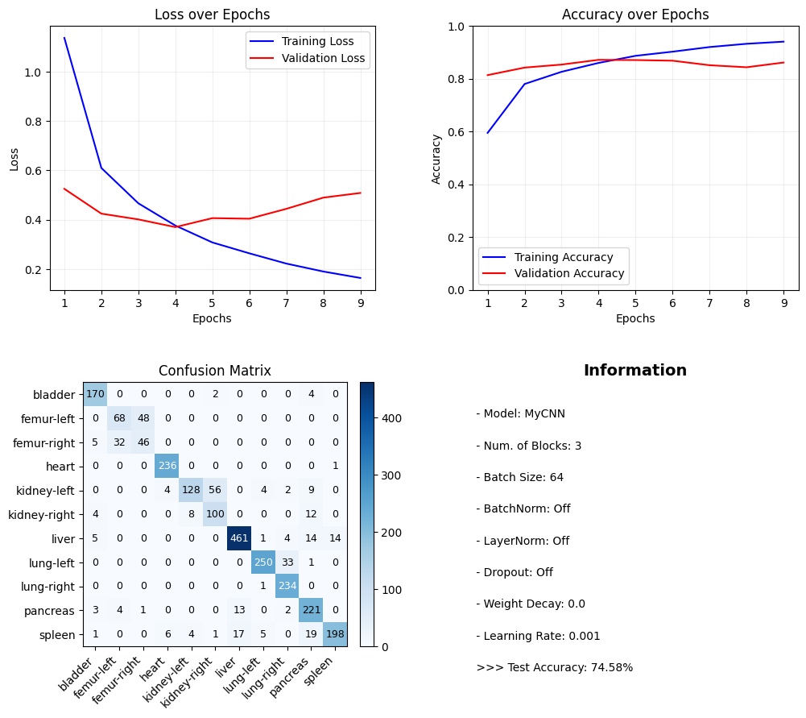

*Εικόνα 2: Γραφήματα Δοκιμής I - Default Τιμές*

**Αριθμός Μπλοκ:** Στην δοκιμή II επιλέχθηκαν 4 συνελικτικά μπλοκ με αποτέλεσμα το test accuracy να αυξηθεί ελαφρώς. Από το σχήμα παρακάτω γίνεται αντιληπτό ότι η βελτίωση στην απόδοση προέκυψε από ορθότερη ταξινόμηση των κλάσεων με ήδη ικανοποιητικά αποτελέσματα, όπως το ήπαρ. Η ασθενής επίδοση στους πνεύμονες και τα μηριαία οστά εξακολουθεί να είναι παρούσα. Επιπλέον, παρατηρείται overfit μετά την 3η εποχή. Στις περισσότερες από τις παρακάτω δοκιμές η επιλογή 4ων μπλοκ οδήγησε σε καλύτερα αποτελέσματα, κι έτσι χρησιμοποιήθηκαν 4 συνελικτικά μπλοκ.

*Εικόνα 3: Γραφήματα Δοκιμής II - 4 Μπλοκ*

**Batch Normalization:** Το batch normalization είναι μία τεχνική που εντός άλλων αποτρέπει την υπερβολική σμίκρυνση ή γιγάντωση βαρών. Από τα test accuracies και τα confusion matrices των δοκιμών στις οποίες χρησιμοποιήθηκε batch normalization προκύπτει το συμπέρασμα ότι η συγκεκριμένη τεχνική δεν είχε θετική επίπτωση στην απόδοση του μοντέλου.

**Layer Normalization:** Το layer normalization είναι μία τεχνική που όπως και το batch normalization αποτρέπει την υπερβολική σμίκρυνση ή γιγάντωση βαρών. Αντίθετα με το batch normalization η συγκεκριμένη τεχνική είχε θετική επίδραση στην απόδοση του μοντέλου. Σημειώνεται ότι η βελτίωση στην ακρίβεια προκύπτει από ορθότερη ταξινόμηση των νεφρών και των πνευμόνων, ενώ όσον αφορά την ταξινόμηση των μηριαίων οστών σε αριστερό και δεξί το μοντέλο φαίνεται και πάλι να επιλέγει τυχαία. Το παραπάνω μπορεί να φανεί εύκολα στο σχήμα παρακάτω όπου αναπαριστάται το confusion matrix της δοκιμής IV.

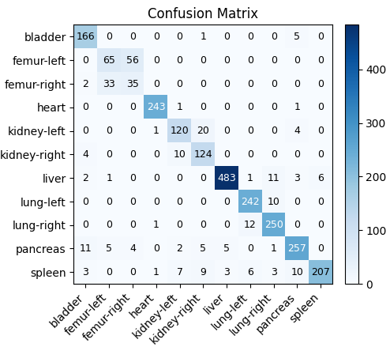

*Εικόνα 4: Confusion Matrix Δοκιμής IV - Layer Normalization*

**Dropout:** Εάν εφαρμοστεί dropout τότε ποσοστό των νευρώνων του δικτύου απενεργοποιούνται κατά την εκπαίδευση έτσι ώστε να αποτραπεί η "αποστήθιση" των training data και κατ' επέκταση το overfit. Η επίδραση τριών πιθανοτήτων dropout μελετήθηκε στις δοκιμές V(a) έως V(c) των οποίων οι καμπύλες κόστους φαίνονται παρακάτω. Η χρήση dropout πράγματι βοήθησε στην αποφυγή overfit, καθώς για πιθανότητες $20$, $50$ και $70\%$ το μοντέλο δεν παρουσιάζει overfit μέχρι και την 4η, 11η και 9η εποχή αντίστοιχα, δηλαδή για περισσότερες εποχές συγκριτικά με την μη-χρήση dropout. Τα αυξημένα test accuracies επιβεβαιώνουν περαιτέρω την χρησιμότητα της συγκεκριμένης τεχνικής.

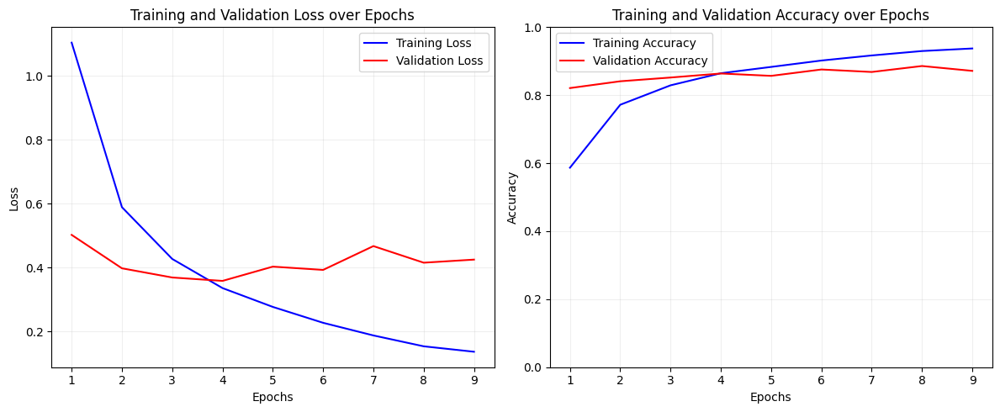

*Εικόνα 5a: Καμπύλες κόστους Δοκιμής V(a) - Dropout Probability: 20%*

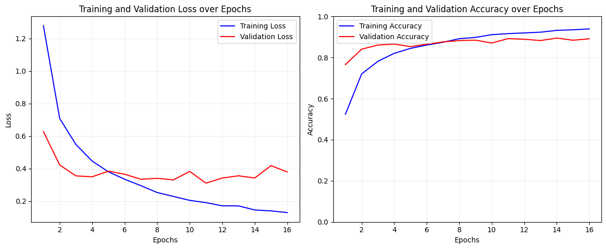

*Εικόνα 5b: Καμπύλες κόστους Δοκιμής V(b) - Dropout Probability: 50%*

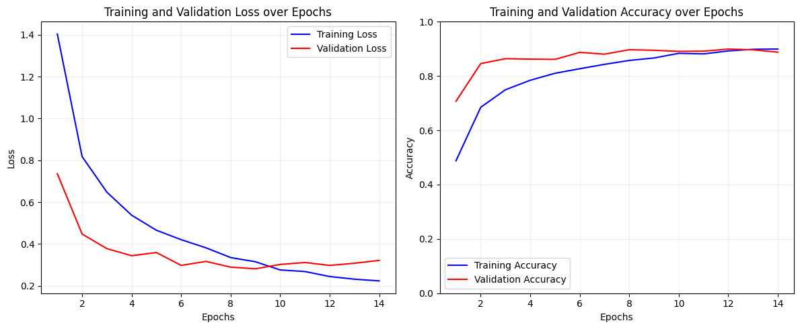

*Εικόνα 5c: Καμπύλες κόστους Δοκιμής V(c) - Dropout Probability: 70%*

**Weight Decay:** Η τεχνική weight decay αποθαρρύνει τα βάρη με μεγάλες τιμές στοχεύοντας στην αποφυγή overfit και στην δυνατότητα καλύτερης γενίκευσης. Η χρήση αυτής της τεχνικής μελετήθηκε στις δοκιμές VI(a) έως VI(c) των οποίων οι καμπύλες κόστους φαίνονται παρακάτω. Όπως φαίνεται στα γραφήματα η τιμή $10^{-4}$ είναι πολύ μικρή και εξακολουθεί να υπάρχει overfit ενώ η τιμή $10^{-2}$ είναι πολύ μεγάλη και οδηγεί σε ασταθή συμπεριφορά. Η τιμή $10^{-3}$ επίσης αδυνατεί να αυξήσει την ακρίβεια του μοντέλου. Παρ' όλ' αυτά, όπως θα φανεί στις μετέπειτα δοκιμές, ανάλογα τον συνδυασμό των τεχνικών το weight decay μπορεί να είναι προσοδοφόρο.

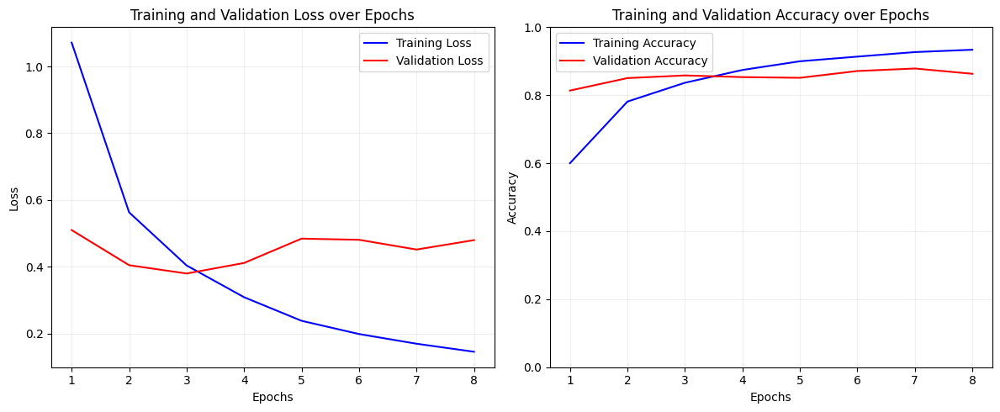

*Εικόνα 6a: Καμπύλες κόστους Δοκιμής VI(a) - Weight Decay: 10⁻⁴*

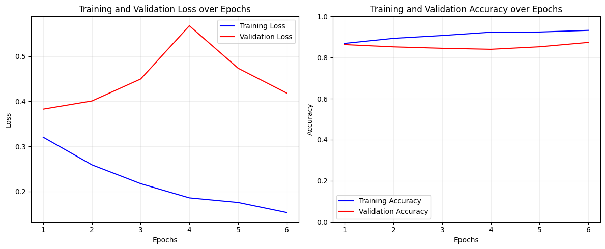

*Εικόνα 6b: Καμπύλες κόστους Δοκιμής VI(b) - Weight Decay: 10⁻³*

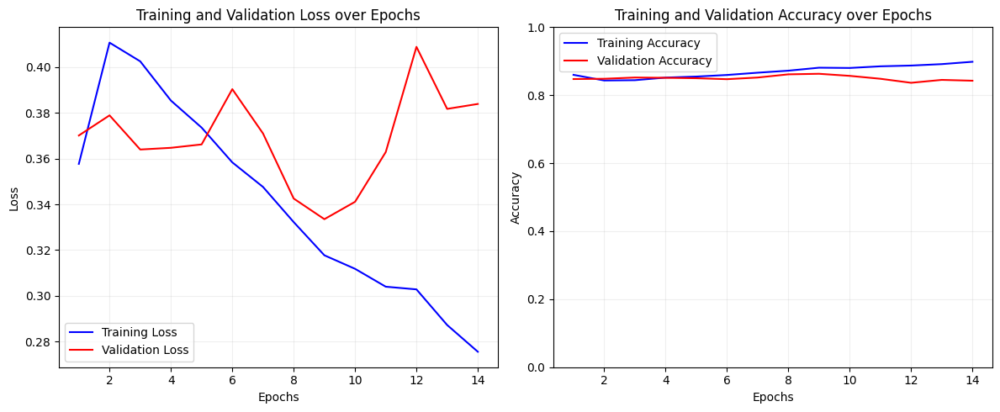

*Εικόνα 6c: Καμπύλες κόστους Δοκιμής VI(c) - Weight Decay: 10⁻²*

**Συνδυασμός Τεχνικών:** Οι δοκιμές VII έως XII αφορούν συνδυασμό τεχνικών. Σημειώνεται ότι για τις τιμές dropout και weight decay παρουσιάζονται σε κάθε παράδειγμα οι τιμές που οδήγησαν στην υψηλότερη ακρίβεια. Ο πιο αποτελεσματικός συνδυασμός ήταν η ενεργοποίηση layer normalization και dropout με πιθανότητα $50\%$ (δοκιμή XI, σχήμα παρακάτω). Επισημαίνεται ότι η αυξημένη ακρίβεια είναι αποτέλεσμα ορθότερης ταξινόμησης των κλάσεων που ήδη παρουσίαζαν μεγάλα ποσοστά σωστής ταξινόμησης στα προηγούμενα μοντέλα, όπως είναι οι πνεύμονες. Όσον αφορά την ταξινόμηση των μηριαίων οστών, το μοντέλο επιλέγει ως επί το πλείστων να τα ταξινομεί ως δεξιά μηριαία οστά και το γεγονός ότι η επιλογή αυτή θα είναι σχεδόν κατά το ήμισυ των περιπτώσεων σωστή επιφέρει υψηλότερη ακρίβεια.

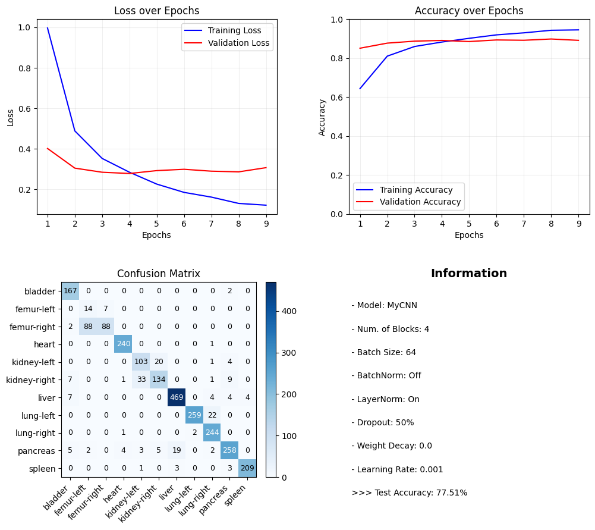

*Εικόνα 7: Γραφήματα Δοκιμής XI - Layer Normalization, 50% Dropout*

### Επιπλέον τεχνικές εκπαίδευσης

Στην προσπάθεια να αυξηθεί περαιτέρω η ακρίβεια του μοντέλου χρησιμοποιήθηκαν τρεις επιπλέον τεχνικές. Η πρώτη τεχνική που αξιοποιήθηκε είναι αυτή του data augmentation. Η τεχνική αυτή προβλέπει την παραγωγή νέων δεδομένων εκπαίδευσης από τα ήδη υπάρχοντα, έτσι ώστε το σύνολο εκπαίδευσης να πληθύνει. Τα νέα δεδομένα προκύπτουν συνήθως από καθρεπτισμό, μικρή περιστροφή, μεγέθυνση ή και μεταφορά των αρχικών εικόνων. Στην παρούσα εργασία αποφεύχθηκε η χρήση καθρεπτισμού καθώς θα προκαλούσε σύγχυση ανάμεσα στις κλάσεις, οι οποίες αποτελούν αριστερό και δεξί μέλος ενός ζεύγους οργάνων ή οστών, ενώ χρησιμοποιήθηκε περιστροφή και οριζόντια και κατακόρυφη μεταφορά. Η τεχνική αυτή επέφερε αύξηση στην ακρίβεια, παράλληλα όμως αυξήθηκε και ο υπολογιστικός χρόνος.

Η δεύτερη τεχνική που δοκιμάστηκε είναι το learning rate scheduling, κατά την οποία σε περίπτωση μη-μείωσης της συνάρτησης κόστους σε διάστημα μερικών εποχών, το learning rate μειώνεται ελαφρώς. Η τεχνική αυτή ήταν επίσης προσοδοφόρα.

Τέλος, εφόσον παρατηρείται ανισορροπία στις κλάσεις έγινε δοκιμή με χρήση weighted cross-entropy συνάρτησης κόστους. Σκοπός αυτής της τεχνικής είναι να αναγκάσει το μοντέλο να δώσει μεγαλύτερη έμφαση στις κλάσεις για τις οποίες έχουμε λιγότερα δεδομένα εκπαίδευσης. Τα βάρη για την κάθε κλάση υπολογίζονται ως εξής:

$$w_i = \frac{N}{C \cdot (n_i + \epsilon)}$$

όπου $N$ ο συνολικός αριθμός δεδομένων εκπαίδευσης, $C$ ο αριθμός κλάσεων $n_i$ ο αριθμός των δεδομένων που ανήκουν στις κλάση $i$ και $\epsilon$ μία μικρή σταθερά για αποφυγή διαίρεσης με το μηδέν (εδώ $\epsilon=0$ εφόσον δεν υπάρχει κλάση με $0$ δείγματα). Έγιναν δοκιμές με χρήση βαρών $w_i$ καθώς και $w_i'=\sqrt{w_i}$ όμως δεν επέφεραν αύξηση στην ακρίβεια.

Ύστερα από δοκιμές με data augmentation, learning rate scheduling και συνδυασμό υπερπαραμέτρων, η υψηλότερη ακρίβεια προέκυψε από μοντέλο με ενεργοποιημένο batch normalization, $50\%$ πιθανότητα dropout και $10^{-4}$ weight decay. Όπως φαίνεται στο σχήμα παρακάτω οι διαφορές με την δοκιμή XI είναι μικρές. Συγκεκριμένα, παρατηρείται βελτίωση κατά την ταξινόμηση της κύστης και του ήπαρ, ενώ για τις υπόλοιπες κλάσεις οι δύο δοκιμές έχουν παρόμοια συμπεριφορά. Είναι αξιοπερίεργο το γεγονός ότι χρησιμοποιώντας data augmentation και learning rate scheduling η προσθήκη batch normalization επέφερε καλύτερα αποτελέσματα απ' ότι το layer normalization ενώ στις προηγούμενες δοκιμές παρατηρήθηκε το αντίθετο.

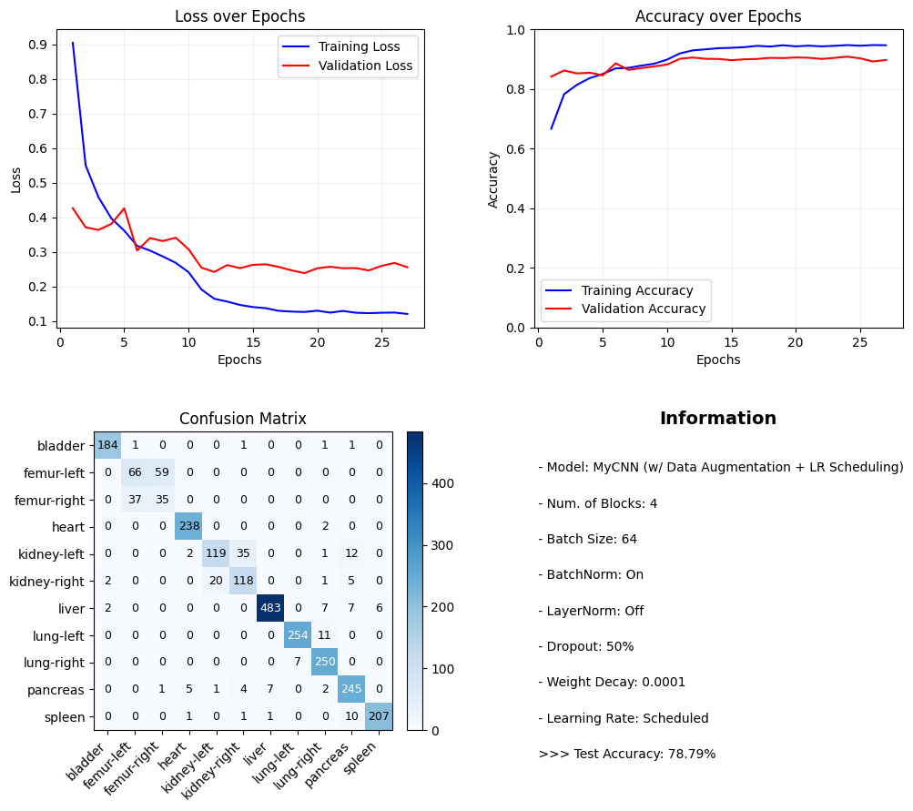

*Εικόνα 8: Γραφήματα Δοκιμής χρήση Data Augmentation, LR Scheduling, Batch Normalization, 50% Dropout και 10⁻⁴ Weight Decay*

---

## Εκπαίδευση CNN αξιοποιώντας Transfer Learning

Σε αυτήν την ενότητα θα αξιοποιηθεί transfer learning για να προσαρμοστεί ένα ήδη εκπαιδευμένο συνελικτικό νευρωνικό δίκτυο στα δεδομένα αυτού προβλήματος. Επιλέχθηκε η χρήση του ResNet18, το μικρότερο μοντέλο μιας οικογένειας συνελικτικών νευρωνικών δικτύων τα οποία εμπεριέχουν επιπλέον και residual συνδέσεις. Μετά το τελευταίο layer του ResNet προστέθηκε ένα fully connected layer με εξόδους όσες και οι κλάσεις του παρόντος προβλήματος, δηλαδή 11. Η μετ-εκπαίδευση του δικτύου έγινε με δύο τρόπους: feature extraction και fine-tuning.

### Feature Extraction

Το feature extraction προβλέπει εκπαίδευση μόνο της κεφαλής ταξινόμησης, δηλαδή του τελευταίου (fully connected) layer. Χρησιμοποιήθηκαν 64 δείγματα σε κάθε batch, $10^{-3}$ learning rate και μέγιστος αριθμός εποχών 25 όμως αξιοποιήθηκε και πάλι early stopping.

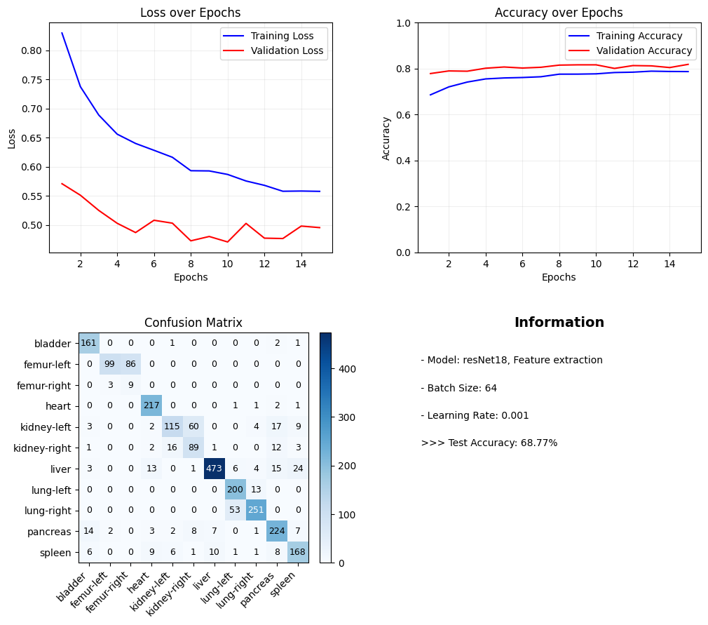

*Εικόνα 9: Γραφήματα Δοκιμής του ResNet18 - Feature Extraction*

Ύστερα, λοιπόν, από feature extraction τα αποτελέσματα δεν είναι ικανοποιητικά. Πέραν από την αδυναμία σωστής ταξινόμησης των μηριαίων οστών η οποία είναι πλέον αναμενόμενη, το μοντέλο παρουσιάζει χειρότερη συμπεριφορά και σε κλάσεις όπως την κύστη, την καρδιά και τον σπλήνα. Συμπεραίνεται, λοιπόν, ότι η εκπαίδευση μόνο του classifier head δεν επαρκεί για να επιτευχτεί καλή ταξινόμηση.

### Fine-Tuning

Κατά την διαδικασία του Fine-Tuning γίνεται εκπαίδευση του classifier head καθώς και μερικών εκ των τελευταίων μπλοκ του μοντέλου. Για την δοκιμή του συγκεκριμένου τρόπου εκπαίδευσης έγινε fine-tuning των τελευταίων 2 μπλοκ, ενώ χρησιμοποιήθηκαν 32 δείγματα σε κάθε batch, $10^{-4}$ learning rate και μέγιστος αριθμός εποχών 15 με early stopping.

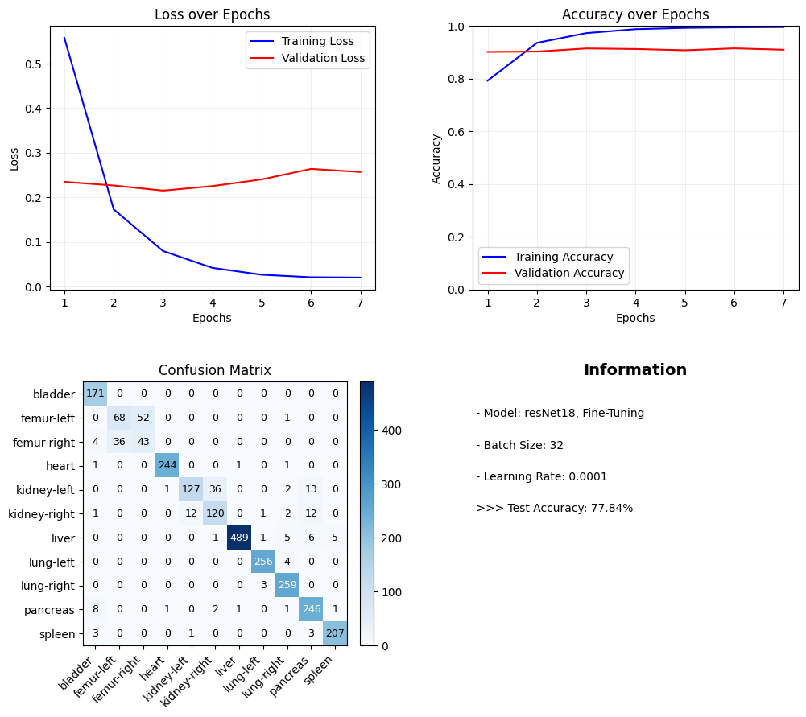

*Εικόνα 10: Γραφήματα Δοκιμής του ResNet18 - Fine-Tuning*

Η επιπλέον μετ-εκπαίδευση των δύο τελευταίων μπλοκ του ResNet επέφερε εμφανώς καλύτερα αποτελέσματα. Σε σύγκριση με το feature extraction γίνεται ορθότερη ταξινόμηση κάθε κλάσης και το test accuracy είναι ως εκ τούτου αρκετά υψηλότερο. Σε σύγκριση με την δοκιμή XI της 3ης ενότητας παρατηρούμε ορθότερη ταξινόμηση σε κάθε κλάση πλην της κύστης με αποτέλεσμα μικρή αύξηση στην ακρίβεια. Επισημαίνεται πως κατά το transfer learning (τόσο του CNN όσο και του ViT) δεν αξιοποιήθηκαν data augmentation και learning rate scheduling και λόγω αυτού γίνεται σύγκριση με την δοκιμή XI και όχι με το μοντέλο που αναλύθηκε στην ενότητα 3.2.

Είναι πολύ πιθανό χρησιμοποιώντας τις δύο προαναφερθείσες τεχνικές η ακρίβεια του ResNet να ξεπεράσει τις δυνατότητες του μοντέλου της 3ης ενότητας. Από τα παραπάνω συμπεραίνεται, λοιπόν, ότι πρώτον για την συγκεκριμένη αρχιτεκτονική το fine-tuning είναι κατά πολύ προτιμότερο έναντι του feature extraction και δεύτερον ότι το fine-tuning συνελικτικού νευρωνικού δικτύου επιφέρει αποτελέσματα συγκρίσιμα και πιθανώς καλύτερα από την "εκ του μηδενός" εκπαίδευση.

---

## Εκπαίδευση ViT αξιοποιώντας Transfer Learning

Η τελευταία ενότητα της εργασίας αφορά την εκπαίδευση ενός vision transformer μέσω transfer learning. Το μοντέλο που χρησιμοποιήθηκε είναι το DeiT-Tiny. Σε αντίθεση με τα συνελικτικά νευρωνικά δίκτυα, η αρχιτεκτονική του ViT διαιρεί την εικόνα σε patches σταθερού μεγέθους, στα οποία προστίθενται positional embeddings ώστε να διατηρηθεί η χωρική πληροφορία που χάνεται κατά το flattening. Ο βασικός μηχανισμός του συστήματος είναι το self-attention, ο οποίος επιτρέπει στο μοντέλο να συσχετίζει κάθε patch με όλα τα υπόλοιπα. Οι ViT χαρακτηρίζονται από έλλειψη inductive bias κι ως εκ τούτου η εκπαίδευσή τους με μικρά σύνολα δεδομένων καθιστάται δύσκολη. Όπως και προηγουμένως θα γίνει feature extraction και fine-tuning.

### Feature Extraction (ViT)

Η εκπαίδευση μόνο του classifier head έγινε με 32 δείγματα σε κάθε batch, $10^{-3}$ learning rate και μέγιστο αριθμό εποχών 15 με early stopping.

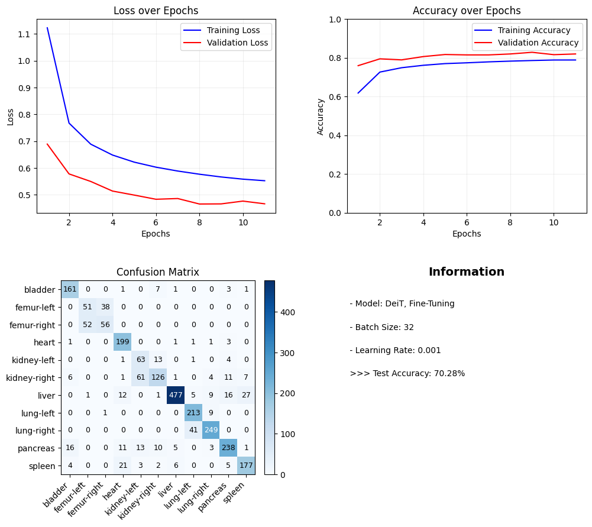

*Εικόνα 11: Γραφήματα Δοκιμής του DeiT-Tiny - Feature Extraction*

Σε σύγκριση με το feature extraction χρήση του ResNet, το παρόν μοντέλο επέφερε υψηλότερη ακρίβεια. Δεν κατάφερε όμως να ξεπεράσει το CNN της 3ης ενότητας, το οποίο παρουσιάζει καλύτερα αποτελέσματα ακόμα και με την default διάταξη.

### Fine-Tuning (ViT)

Τέλος, θα γίνει fine-tuning του τελευταίου μπλοκ του DeiT. Η εκπαίδευση έγινε με 16 δείγματα σε κάθε batch, $10^{-4}$ learning rate και αριθμό εποχών 10 (χωρίς early stopping).

*Εικόνα 12: Γραφήματα Δοκιμής του DeiT-Tiny - Fine-Tuning*

Συγκριτικά με το feature extraction το fine-tuning οδήγησε σε υψηλότερη ακρίβεια. Όμως, όπως και προηγουμένως δεν καταφέρνει να ξεπεράσει το CNN της 3ης ενότητας. Το συμπέρασμα που προκύπτει, λοιπόν, είναι ότι για το συγκεκριμένο πρόβλημα ταξινόμησης το μοντέλο DeiT δεν είναι κατάλληλο.

---

## Συμπεράσματα

Ύστερα από τις παραπάνω πειραματικές δοκιμές χρήση διαφορετικών υπερπαραμέτρων, τεχνικών εκπαίδευσης και αρχιτεκτονικών προκύπτει ότι για το συγκεκριμένο πρόβλημα ταξινόμησης το fine-tuning συνελικτικού νευρωνικού δικτύου αναδείχθηκε ως η επιλογή που επιφέρει την υψηλότερη ακρίβεια. Η "εκ του μηδενός" εκπαίδευση CNN μπορεί επίσης να οδηγήσει σε ικανοποιητικά αποτελέσματα δεδομένου ότι επιλέγονται σωστά η αρχιτεκτονική και οι υπερπάραμετροι, ενώ το transfer learning χρήση ViT δεν αποδίδει. Από τα δεδομένα αυτά πηγάζουν ενδιαφέροντα συμπεράσματα τόσο για τις επιλογές που γίνονται στην σχεδίαση όσο και για το ίδιο το πρόβλημα ταξινόμησης.

Όσον αφορά την επιλογή της αρχιτεκτονικής η ασθενής απόδοση του ViT εξηγείται από το γεγονός ότι τα δεδομένα εκπαίδευσης δεν επαρκούν. Η βασική διαφορά μεταξύ vision transformer και συνελικτικών νευρωνικών δικτύων απαντάται στην χρήση μηχανισμού self-attention έναντι συνελικτικών φίλτρων. Η χρήση φίλτρων προϋποθέτει την παραδοχή ότι τα pixels τα οποία βρίσκονται στην ίδια περιοχή σχετίζονται μεταξύ τους. Αντίθετα ο μηχανισμός self-attention επιτρέπει στο μοντέλο να μάθει τον τρόπο με τον οποίο η κάθε περιοχή της εικόνας σχετίζεται με τις υπόλοιπες. Το παραπάνω αποτελεί πλεονέκτημα μονάχα στην περίπτωση που τα training data επαρκούν ώστε το μοντέλο να μάθει την χωρική συσχέτιση των περιοχών των εικόνων εισόδου. Από τις δοκιμές που έγιναν στα πλαίσια αυτής της εργασίας φαίνεται ότι το μέγεθος του συνόλου δεδομένων καθιστά την χρήση ViT μη βέλτιστη επιλογή.

Αντιθέτως, το fine-tuning του ResNet κατάφερε να ξεπεράσει το CNN της 3ης ενότητας χωρίς χρήση data augmentation και learning rate scheduling και πιθανότατα να καταφέρει να το ξεπεράσει με την χρήση αυτών των τεχνικών επίσης. Η εκπαίδευση του ResNet έγινε πάνω στο σύνολο δεδομένων ImageNet το οποίο εμπεριέχει μεγάλο αριθμό RGB εικόνων υψηλής ανάλυσης. Φαίνεται, λοιπόν, ότι εφόσον γίνει μετεκπαίδευση των τελευταίων μπλοκ, η ήδη υπάρχουσα γνώση του μοντέλου η οποία βασίζεται εντός άλλων στο χρώμα και την υφή της εικόνας για ορθή ταξινόμηση, μπορεί να εφαρμοστεί επιτυχώς για την ταξινόμηση ασπρόμαυρων, χαμηλής ανάλυσης εικόνων. Έτσι, θεωρείται σαφώς πιθανό το fine-tuning σε παραπάνω από δύο μπλοκ να μπορέσει να αυξήσει περαιτέρω την ακρίβεια, δεδομένου ότι η διαθέσιμη υπολογιστική ισχύς επιτρέπει κάτι τέτοιο. Όπως, λοιπόν, φανερώνεται από την συμπεριφορά της κάθε αρχιτεκτονικής, για το συγκεκριμένο πρόβλημα η μετ-εκπαίδευση συνελικτικού νευρωνικού δικτύου καθίσταται καλύτερη επιλογή ανάμεσα στις τρεις.

Κλείνοντας, είναι ιδιαίτερα σημαντικό να σχολιαστεί πόσο μεγάλη επίδραση έχει το dataset στην έκβαση του προβλήματος. Σε όλες τις παραπάνω δοκιμές, ανεξάρτητα από την αρχιτεκτονική και τις υπερπαραμέτρους που χρησιμοποιήθηκαν, το μεγαλύτερο μέρος των σφαλμάτων προέκυψε από την αδυναμία ταξινόμησης των νεφρών και (κυρίως) των μηριαίων οστών σε αριστερό και δεξί. Η δυσκολία σε αυτόν τον διαχωρισμό οφείλεται αφενός στο γεγονός ότι υπάρχει ανισορροπία στα δεδομένα εκπαίδευσης και αφετέρου στο γεγονός ότι το αριστερό και το δεξί μέλος αυτών των ζευγών παρουσιάζουν εξ ορισμού μεγάλες ομοιότητες. Για να μειωθούν, λοιπόν, τα λάθη ταξινόμησης όσον αφορά αυτές τις κλάσεις, ενδεχομένως χρειάζονται περισσότερα δεδομένα εκπαίδευσης που να αντιστοιχούν σε νεφρά και μηριαία οστά. Εξίσου πιθανό είναι, όμως, η χαμηλή ανάλυση των εικόνων εισόδου να μην μεταφέρει αρκετή πληροφορία ώστε να γίνουν σαφείς οι διαφορές ανάμεσα σε αριστερό και δεξί μέλος, επομένως η εκπαίδευση με παραπάνω δεδομένα να αδυνατεί να μειώσει τα σφάλματα.

Είναι βέβαια ενθαρρυντικό το γεγονός ότι υπάρχει σύγχυση κυρίως ανάμεσα στα αριστερά και δεξιά μέλη του ίδιου οργάνου ή οστού και όχι ανάμεσα σε αυτά και μία τρίτη κλάση. Εάν, δηλαδή, επρόκειτο για ένα πρόβλημα με πραγματική εφαρμογή, στο οποίο αρκεί η διάκριση ανάμεσα στα οστά και τα υπόλοιπα όργανα, χωρίς όμως να μας ενδιαφέρει η διάκριση ανάμεσα σε αριστερό και δεξί οστό, τότε έχει νόημα να ενωθούν οι δύο αυτές κλάσεις σε μία, εξαλείφοντας έτσι μεγάλο αριθμό σφαλμάτων. Τα αριθμητικά αποτελέσματα μίας δοκιμής, λοιπόν, αποτελούν κριτήριο για την επιτυχία μίας σχεδίασης μόνο εφόσον ερμηνευτούν στο πλαίσιο που ορίζουν τα φυσικά χαρακτηριστικά του προβλήματος.
